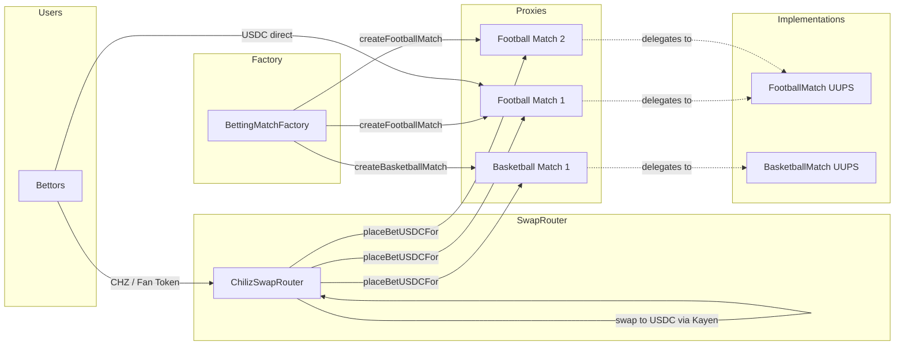
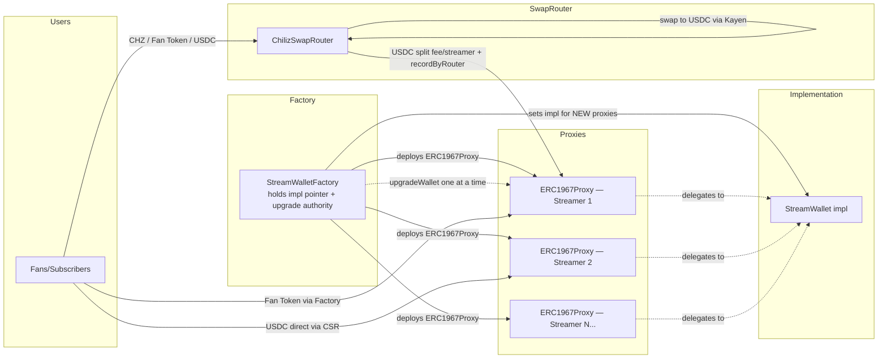

# ChilizTV Smart Contracts - Technical Documentation

**Author**: ChilizTV Team  
**Target Audience**: Solidity developers, DevOps, QA, backend/frontend integrators

---

## 1. Overview

ChilizTV provides a decentralized platform with two main systems:

1. **Betting System** — UUPS-based match betting with multiple markets, settled entirely in USDC
2. **Streaming System** — UUPS streamer wallets (one per streamer, factory-gated upgrades) with subscriptions and donations
3. **Unified Swap Router** — Single `ChilizSwapRouter` that accepts CHZ, WCHZ, fan tokens, or any ERC20, swaps to USDC via Kayen DEX, and forwards to the target (betting match or streamer/treasury)

All settlements happen in **USDC**. Users can pay with any token — the swap router handles conversion automatically.

---

## 2. Architecture

### 2.1 Betting System (UUPS Pattern + Multi-Sport)



**Components:**
- **BettingMatch** (`src/betting/BettingMatch.sol`): Abstract base contract with dynamic odds
  - Per-market odds registry with index-based deduplication
  - Each bet locks its odds at placement time (x10000 precision)
  - Market lifecycle: Inactive → Open → Suspended → Closed → Resolved
  - Role-based access: ADMIN, RESOLVER, ODDS_SETTER, PAUSER, TREASURY
  
- **FootballMatch** (`src/betting/FootballMatch.sol`): Football-specific markets
  - WINNER (1X2), GOALS_TOTAL (O/U), BOTH_SCORE, HALFTIME, CORRECT_SCORE, FIRST_SCORER
  
- **BasketballMatch** (`src/betting/BasketballMatch.sol`): Basketball-specific markets
  - WINNER, TOTAL_POINTS, SPREAD, QUARTER_WINNER, FIRST_TO_SCORE, HIGHEST_QUARTER
  
- **BettingMatchFactory** (`src/betting/BettingMatchFactory.sol`): Factory for sport-specific proxies
  - Deploys the initial Football / Basketball implementations in its constructor
  - Implementation pointers are **mutable** (`setFootballImplementation` / `setBasketballImplementation`, `onlyOwner`) and affect ONLY future proxy deployments. Existing proxies are not auto-upgraded.
  - `createFootballMatch(name, owner)` / `createBasketballMatch(name, owner)` — grants `DEFAULT_ADMIN_ROLE` on the proxy to `owner`. **Prefer a multisig here** (see §6.1).
  - Tracks all deployed matches by sport type

- **ChilizSwapRouter** (`src/swap/ChilizSwapRouter.sol`): Unified swap router for the entire platform
  - Single contract handling **both** betting and streaming swap flows
  - Accepts native CHZ, WCHZ, fan tokens, any ERC20, or USDC directly
  - Betting: swaps to USDC and calls `placeBetUSDCFor` on BettingMatch
  - Streaming: swaps to USDC, splits platform fee to treasury, sends remainder to streamer
  - `placeBetWithCHZ{value}()` — native CHZ → USDC → bet
  - `placeBetWithToken()` — any ERC20 → USDC → bet
  - `placeBetWithUSDC()` — USDC direct → bet (no swap)
  - `donateWithCHZ{value}()` / `subscribeWithCHZ{value}()` — native CHZ → USDC → streamer
  - `donateWithToken()` / `subscribeWithToken()` — any ERC20 → USDC → streamer
  - `donateWithUSDC()` / `subscribeWithUSDC()` — USDC direct → streamer (no swap)
  - Requires `SWAP_ROUTER_ROLE` on each BettingMatch proxy
  - Admin: `setTreasury()`, `setPlatformFeeBps()` (Ownable)

**Betting Flow:**
1. Factory creates sport-specific match proxy (football or basketball)
2. Admin adds markets with bytes32 type + initial odds (x10000)
3. Admin opens markets for betting
4. Users bet via **ChilizSwapRouter** (CHZ/tokens) or **placeBetUSDC** (direct USDC)
5. All bets settle in USDC — odds locked at bet time
6. Odds can change → new bets get new odds, old bets keep locked odds
7. Admin resolves markets with result
8. Winners claim USDC payouts: `amount × lockedOdds / 10000`

---

### 2.2 Streaming System (UUPS Pattern, factory-gated upgrades)



> **No beacon.** Each proxy is independent; upgrades happen one wallet at a time via `StreamWalletFactory.upgradeWallet(streamer, newImpl)`.

**Components:**
- **StreamWallet** (`src/streamer/StreamWallet.sol`): UUPS-upgradeable wallet for streamers
  - Receives subscriptions and donations (denominated in USDC)
  - Splits platform fee to treasury, remainder accumulates in the wallet
  - Streamer drains their full USDC balance via `withdrawRevenue()` (no amount argument)
  - Upgrade authority is locked to the factory — streamers cannot self-upgrade

- **StreamWalletFactory** (`src/streamer/StreamWalletFactory.sol`): Factory for deploying & upgrading streamer wallets
  - Deploys `ERC1967Proxy` instances (one per streamer, created lazily on first subscribe/donate)
  - Holds the current implementation pointer (`setImplementation` — affects NEW deployments only)
  - Upgrades existing wallets one at a time via `upgradeWallet(streamer, newImpl)` — **not atomic across wallets**
  - Handles fan-token subscriptions/donations on behalf of streamers and enforces the platform fee split

> There is **no `StreamBeaconRegistry`** and no `UpgradeableBeacon` in the code. The streaming system uses per-wallet UUPS, not a beacon. Earlier docs described a beacon design that was never shipped.

- **StreamSwapRouter** — **Removed** (merged into ChilizSwapRouter)
  - All streaming payment functions (donateWithCHZ/Token/USDC, subscribeWithCHZ/Token/USDC) are now on `ChilizSwapRouter`

**Streaming Flow:**
1. Factory creates StreamWallet proxy for a streamer
2. Users donate/subscribe via **ChilizSwapRouter** (CHZ/tokens/USDC) or **Factory** (fan tokens)
3. Non-USDC tokens swapped to USDC automatically via Kayen DEX
4. Platform fee split to treasury, net amount to streamer
5. Streamer withdraws accumulated balance

---

## 3. Smart Contracts Reference

### 3.1 Betting Contracts

#### BettingMatch.sol (Abstract Base)
```solidity
// UUPS upgradeable match with dynamic odds system
// ALL BETS SETTLED IN USDC
abstract contract BettingMatch {
    // Odds precision: x10000 (2.18x = 21800, min 1.0001x = 10001, max 100x = 1000000)
    uint32 public constant ODDS_PRECISION = 10000;
    
    enum MarketState { Inactive, Open, Suspended, Closed, Resolved, Cancelled }
    
    // Core betting functions (USDC only)
    function placeBetUSDC(uint256 marketId, uint64 selection, uint256 amount) external;
    function placeBetUSDCFor(address user, uint256 marketId, uint64 selection, uint256 amount) external;
    function claim(uint256 marketId, uint256 betIndex) external;
    function claimRefund(uint256 marketId, uint256 betIndex) external;
    function claimAll(uint256 marketId) external;
    
    // USDC configuration (ADMIN_ROLE)
    function setUSDCToken(address _usdcToken) external;
    
    // Treasury solvency (TREASURY_ROLE)
    function fundUSDCTreasury(uint256 amount) external;
    function emergencyWithdrawUSDC(uint256 amount) external;
    function getUSDCSolvency() external view returns (uint256 balance, uint256 liabilities, uint256 pool);
    
    // Market management (ADMIN_ROLE)
    function openMarket(uint256 marketId) external;
    function suspendMarket(uint256 marketId) external;
    function closeMarket(uint256 marketId) external;
    function cancelMarket(uint256 marketId, string calldata reason) external;
    
    // Odds management (ODDS_SETTER_ROLE)  
    function setMarketOdds(uint256 marketId, uint32 newOdds) external;
    
    // Resolution (RESOLVER_ROLE)
    function resolveMarket(uint256 marketId, uint64 result) external;
    
    // Abstract (implemented by sport-specific contracts)
    function addMarketWithLine(bytes32 marketType, uint32 initialOdds, int16 line) external virtual;
}
```

#### FootballMatch.sol
```solidity
// Football-specific betting markets
contract FootballMatch is BettingMatch {
    // Market types (bytes32 for gas efficiency)
    bytes32 public constant MARKET_WINNER = keccak256("WINNER");        // 0=Home, 1=Draw, 2=Away
    bytes32 public constant MARKET_GOALS_TOTAL = keccak256("GOALS_TOTAL"); // 0=Under, 1=Over
    bytes32 public constant MARKET_BOTH_SCORE = keccak256("BOTH_SCORE");   // 0=No, 1=Yes
    bytes32 public constant MARKET_HALFTIME = keccak256("HALFTIME");
    bytes32 public constant MARKET_CORRECT_SCORE = keccak256("CORRECT_SCORE");
    bytes32 public constant MARKET_FIRST_SCORER = keccak256("FIRST_SCORER");
    
    function initialize(string memory _matchName, address _owner) external;
    function addMarket(bytes32 marketType, uint32 initialOdds) external override;
    function addMarketWithLine(bytes32 marketType, uint32 initialOdds, int16 line) external;
    function getFootballMarket(uint256 marketId) external view returns (...);
}
```

#### BasketballMatch.sol
```solidity
// Basketball-specific betting markets
contract BasketballMatch is BettingMatch {
    bytes32 public constant MARKET_WINNER = keccak256("WINNER");           // 0=Home, 1=Away
    bytes32 public constant MARKET_TOTAL_POINTS = keccak256("TOTAL_POINTS");
    bytes32 public constant MARKET_SPREAD = keccak256("SPREAD");
    bytes32 public constant MARKET_QUARTER_WINNER = keccak256("QUARTER_WINNER");
    
    function initialize(string memory _matchName, address _owner) external;
    function addMarketWithLine(bytes32 marketType, uint32 initialOdds, int16 line) external;
    function addMarketWithQuarter(bytes32 marketType, uint32 initialOdds, int16 line, uint8 quarter) external;
}
```

#### BettingMatchFactory.sol
```solidity
// Factory for creating sport-specific match proxies
contract BettingMatchFactory {
    enum SportType { FOOTBALL, BASKETBALL }
    
    function createFootballMatch(string calldata _matchName, address _owner) external returns (address proxy);
    function createBasketballMatch(string calldata _matchName, address _owner) external returns (address proxy);
    function getAllMatches() external view returns (address[] memory);
    function getSportType(address matchAddress) external view returns (SportType);
}
```

#### ChilizSwapRouter.sol
```solidity
// Unified swap router: any token → USDC → bet or streamer/treasury
contract ChilizSwapRouter is ReentrancyGuard, Ownable {
    // ── BETTING ──────────────────────────────────────────────
    // Native CHZ → USDC → bet
    function placeBetWithCHZ(
        address bettingMatch, uint256 marketId, uint64 selection,
        uint256 amountOutMin, uint256 deadline
    ) external payable;
    
    // USDC direct → bet (no swap)
    function placeBetWithUSDC(
        address bettingMatch, uint256 marketId, uint64 selection, uint256 amount
    ) external;
    
    // Any ERC20 → USDC → bet
    function placeBetWithToken(
        address token, uint256 amount, address bettingMatch,
        uint256 marketId, uint64 selection,
        uint256 amountOutMin, uint256 deadline
    ) external;
    
    // ── STREAMING (donations & subscriptions) ────────────────
    // Native CHZ → USDC → donate/subscribe
    function donateWithCHZ(address streamer, string calldata message, uint256 amountOutMin, uint256 deadline) external payable;
    function subscribeWithCHZ(address streamer, uint256 duration, uint256 amountOutMin, uint256 deadline) external payable;
    
    // USDC direct (no swap)
    function donateWithUSDC(address streamer, string calldata message, uint256 amount) external;
    function subscribeWithUSDC(address streamer, uint256 duration, uint256 amount) external;
    
    // Any ERC20 → USDC → donate/subscribe
    function donateWithToken(address token, uint256 amount, address streamer, string calldata message, uint256 amountOutMin, uint256 deadline) external;
    function subscribeWithToken(address token, uint256 amount, address streamer, uint256 duration, uint256 amountOutMin, uint256 deadline) external;
    
    // ── ADMIN ────────────────────────────────────────────────
    function setTreasury(address _treasury) external;
    function setPlatformFeeBps(uint16 _feeBps) external;
}
```

---

### 3.2 Streaming Contracts

#### StreamWallet.sol
```solidity
// UUPS-upgradeable wallet for streamers. Upgrade authority is locked to the factory.
contract StreamWallet {
    // Initialize — called once by the factory via the proxy constructor.
    function initialize(
        address streamer_,
        address treasury_,
        uint16  platformFeeBps_,
        address kayenRouter_,
        address usdc_
    ) external;

    // Fan-token direct path (factory-only). Pulls tokens, swaps to USDC, splits.
    function recordSubscription(
        address subscriber,
        uint256 amount,
        uint256 duration,
        uint256 amountOutMin,
        uint256 deadline,
        address token
    ) external;

    // Swap-router path. State-only bookkeeping; USDC already transferred in.
    function recordSubscriptionByRouter(address subscriber, uint256 totalUsdcAmount, uint256 duration) external;
    function recordDonationByRouter(address donor, uint256 totalUsdcAmount, string calldata message) external;

    // Donation paths (direct + factory-initiated)
    function donate(uint256 amount, string calldata message, uint256 amountOutMin, uint256 deadline, address token) external;
    function donateFor(address donor, uint256 amount, string calldata message, uint256 amountOutMin, uint256 deadline, address token) external;

    // Streamer drains full USDC balance.
    function withdrawRevenue() external;
}
```

#### StreamWalletFactory.sol
```solidity
// Factory for creating streamer wallets (ERC1967 proxies) and driving per-wallet upgrades.
contract StreamWalletFactory {
    // Explicit wallet creation (normally unnecessary — wallets are created lazily
    // on first subscribeToStream / donateToStream).
    function deployWalletFor(address streamer) external returns (address);

    // Pulls `amount` of `token` (or takes native CHZ via ChilizSwapRouter) from msg.sender
    // and forwards the subscription to the streamer's wallet.
    function subscribeToStream(
        address streamer,
        uint256 duration,
        uint256 amount,
        uint256 amountOutMin,
        uint256 deadline,
        address token
    ) external payable nonReentrant;

    function donateToStream(
        address streamer,
        string  calldata message,
        uint256 amount,
        uint256 amountOutMin,
        uint256 deadline,
        address token
    ) external payable nonReentrant;

    // Upgrade management — owner only.
    function setImplementation(address newImpl) external; // affects NEW wallets
    function upgradeWallet(address streamer, address newImpl) external; // per-wallet, not atomic
}
```
> **No `StreamBeaconRegistry`.** The streaming system has no beacon contract. Earlier docs described one; it was never implemented. Per-wallet UUPS via the factory is the only upgrade path.

---

## 4. Deployment

### 4.1 Environment Variables

```bash
export PRIVATE_KEY=0x...           # Deployer private key
export RPC_URL=https://...         # Network RPC endpoint
export SAFE_ADDRESS=0x...          # Safe multisig (treasury + registry owner)
export ETHERSCAN_API_KEY=...       # For contract verification
```

### 4.2 Deploy Betting System Only

```bash
forge script script/DeployBetting.s.sol \
  --rpc-url $RPC_URL \
  --broadcast \
  --verify
```

**Deploys:**
- BettingMatch implementation
- BettingMatchFactory

### 4.3 Deploy Streaming System Only

```bash
forge script script/DeployStreaming.s.sol \
  --rpc-url $RPC_URL \
  --broadcast \
  --verify
```

**Deploys:**
- StreamWallet implementation
- StreamWalletFactory (transfer ownership to Safe after deploy)

### 4.4 Deploy Complete System

```bash
forge script script/DeployAll.s.sol \
  --rpc-url $RPC_URL \
  --broadcast \
  --verify
```

**Deploys both betting and streaming systems.**

### 4.5 Post-Deploy Wiring — **DO NOT SKIP**

`DeployAll` creates the contracts; several runtime links are left to you. Miss
any of these and bets/claims/resolutions will silently revert. Re-check each
time you deploy a **new match proxy**, and also when you register the swap
router with the streaming factory.

**Per new BettingMatch proxy**

| # | Call | Caller (role) | If skipped |
|---|------|---------------|------------|
| 1 | `match.setUSDCToken(usdc)` | `ADMIN_ROLE` | `placeBetUSDC` reverts `USDCNotConfigured` |
| 2 | `match.setLiquidityPool(pool)` | `ADMIN_ROLE` | `placeBetUSDC` reverts `LiquidityPoolNotConfigured` |
| 3 | `pool.authorizeMatch(match)` | `DEFAULT_ADMIN_ROLE` (admin key on pool — **NOT** the treasury Safe) | Pool refuses `recordBet` / `payWinner` → reverts `MatchNotAuthorized` |
| 4 | `match.grantRole(RESOLVER_ROLE, oracle)` | `DEFAULT_ADMIN_ROLE` (match admin) | `resolveMarket` reverts. **RESOLVER is deliberately NOT granted at init** to separate the resolver key from the admin key. |
| 5 | `match.grantRole(SWAP_ROUTER_ROLE, ChilizSwapRouter)` | `DEFAULT_ADMIN_ROLE` (match admin) | Any `placeBetWith*` routed through the swap router reverts |
| 6 | `match.setMaxAllowedOdds(maxOdds)` *(recommended)* | `ADMIN_ROLE` | Falls back to hardcoded `MAX_ODDS = 100x` (1_000_000). Tighten per-sport to harden against odds-setter fat-fingers. |
| 7 | `pool.setMaxBetAmount(cap)` *(recommended)* | `DEFAULT_ADMIN_ROLE` (pool admin) | 0 disables. Any single bet larger than this (post-fee netStake) reverts `BetAmountAboveCap`. |

**Swap router ↔ streaming factory (one-time)**

Order matters — the router asserts the factory knows about it:

1. `StreamWalletFactory.setSwapRouter(ChilizSwapRouter)`
2. `ChilizSwapRouter.setStreamWalletFactory(streamWalletFactory)` — reverts `RouterNotConfiguredOnFactory` if (1) was skipped.

**Optional but recommended**

- `ChilizSwapRouter.setMatchFactory(bettingMatchFactory)` — without this, the router will forward USDC to any `bettingMatch` argument, not just factory-registered ones (M-02 hardening).
- **Role separation on `LiquidityPool` (critical):** the admin key (`DEFAULT_ADMIN_ROLE`) and the `treasury` state variable MUST be distinct addresses. Admin is typically a Safe or ops EOA for operational changes; the treasury is the Safe that pulls accrued funds. Deploying with the same address collapses the compartmentalisation and lets an admin compromise drain accrued treasury. See [docs/treasury.md](docs/treasury.md).
- Transfer `DEFAULT_ADMIN_ROLE` on `BettingMatchFactory`, `StreamWalletFactory`, and `ChilizSwapRouter` to the Safe multisig (these are singleton admin keys for those contracts — separate from the pool's admin/treasury split).
- Seed the `LiquidityPool` via `deposit(amount, receiver)` (requires USDC approval first). First deposit is safe against inflation attack (`_decimalsOffset = 6`).

---

## 5. Usage Examples

### 5.1 Create a Football Match

```bash
cast send $BETTING_FACTORY \
  "createFootballMatch(string,address)" \
  "Real Madrid vs Barcelona" \
  $OWNER_ADDRESS \
  --rpc-url $RPC_URL \
  --private-key $PRIVATE_KEY
```

### 5.2 Add Market with Odds (x10000 precision)

```bash
# Add WINNER market (1X2) with initial odds 2.20x = 22000, line = 0
cast send $MATCH_ADDRESS \
  "addMarketWithLine(bytes32,uint32,int16)" \
  $(cast keccak "WINNER") \
  22000 \
  0 \
  --rpc-url $RPC_URL \
  --private-key $PRIVATE_KEY
```

### 5.3 Open Market for Betting

```bash
cast send $MATCH_ADDRESS \
  "openMarket(uint256)" \
  0 \
  --rpc-url $RPC_URL \
  --private-key $PRIVATE_KEY
```

### 5.4 Place a Bet

```bash
# Option A: Bet 100 USDC directly on the match contract (market 0, selection 0 = Home)
# Requires: USDC approve first
cast send $USDC_ADDRESS "approve(address,uint256)" $MATCH_ADDRESS 100000000 --rpc-url $RPC_URL --private-key $PRIVATE_KEY
cast send $MATCH_ADDRESS \
  "placeBetUSDC(uint256,uint64,uint256)" \
  0 0 100000000 \
  --rpc-url $RPC_URL --private-key $PRIVATE_KEY

# Option B: Bet with native CHZ via swap router (auto-converts to USDC)
cast send $SWAP_ROUTER \
  "placeBetWithCHZ(address,uint256,uint64,uint256,uint256)" \
  $MATCH_ADDRESS 0 0 0 $(date -d '+1 hour' +%s) \
  --value 10ether \
  --rpc-url $RPC_URL --private-key $PRIVATE_KEY

# Option C: Bet with fan token via swap router (auto-converts to USDC)
# Requires: token approve on swap router first
cast send $FAN_TOKEN "approve(address,uint256)" $SWAP_ROUTER $AMOUNT --rpc-url $RPC_URL --private-key $PRIVATE_KEY
cast send $SWAP_ROUTER \
  "placeBetWithToken(address,uint256,address,uint256,uint64,uint256,uint256)" \
  $FAN_TOKEN $AMOUNT $MATCH_ADDRESS 0 0 0 $(date -d '+1 hour' +%s) \
  --rpc-url $RPC_URL --private-key $PRIVATE_KEY

# Option D: Bet with USDC via swap router (no swap, passes through)
cast send $USDC_ADDRESS "approve(address,uint256)" $SWAP_ROUTER 100000000 --rpc-url $RPC_URL --private-key $PRIVATE_KEY
cast send $SWAP_ROUTER \
  "placeBetWithUSDC(address,uint256,uint64,uint256)" \
  $MATCH_ADDRESS 0 0 100000000 \
  --rpc-url $RPC_URL --private-key $PRIVATE_KEY
```

### 5.5 Update Odds

```bash
# Change odds to 2.50x = 25000 (existing bets keep their locked odds)
cast send $MATCH_ADDRESS \
  "setMarketOdds(uint256,uint32)" \
  0 \
  25000 \
  --rpc-url $RPC_URL \
  --private-key $PRIVATE_KEY
```

### 5.6 Resolve Market

```bash
# Home team won (result = 0)
cast send $MATCH_ADDRESS \
  "resolveMarket(uint256,uint64)" \
  0 \
  0 \
  --rpc-url $RPC_URL \
  --private-key $PRIVATE_KEY
```

### 5.7 Claim Winnings

```bash
# Claim bet at index 0 from market 0
cast send $MATCH_ADDRESS \
  "claim(uint256,uint256)" \
  0 \
  0 \
  --rpc-url $RPC_URL \
  --private-key $PRIVATE_KEY
```

### 5.8 Create Streamer Wallet (optional — wallets are created lazily)

Wallets are normally deployed the first time someone subscribes or donates. If
you need to front-run that for a known streamer (e.g. to hand them the address
in advance), use:

```bash
cast send $STREAM_FACTORY \
  "deployWalletFor(address)" \
  $STREAMER_ADDRESS \
  --rpc-url $RPC_URL \
  --private-key $PRIVATE_KEY
```

### 5.9 Subscribe / Donate to a Stream

All payment paths (CHZ, any ERC20, USDC direct) are on **ChilizSwapRouter**, not the
factory. Use the factory directly only for fan-token paths that don't need a swap.

```bash
# Preferred: subscribe with CHZ via the swap router (swaps to USDC, splits, records)
cast send $SWAP_ROUTER \
  "subscribeWithCHZ(address,uint256,uint256,uint256)" \
  $STREAMER_ADDRESS 2592000 0 $(date -d '+5 min' +%s) \
  --value 10ether \
  --rpc-url $RPC_URL --private-key $PRIVATE_KEY

# Direct USDC path via the factory (fan-token path uses the same function
# with token = fan-token address; on-the-fly swap happens inside the wallet):
#   subscribeToStream(streamer, duration, amount, minOut, deadline, token)
cast send $STREAM_FACTORY \
  "subscribeToStream(address,uint256,uint256,uint256,uint256,address)" \
  $STREAMER_ADDRESS 2592000 100000000 0 $(date -d '+5 min' +%s) $USDC \
  --rpc-url $RPC_URL --private-key $PRIVATE_KEY
```

---

## 6. Security & Access Control

### 6.1 Betting System

**Roles on each BettingMatch:**
- **ADMIN_ROLE**: Add markets, control market state (open/suspend/close/cancel), `setMaxAllowedOdds`, `setUSDCToken`, `setLiquidityPool`
- **ODDS_SETTER_ROLE**: Update market odds in real-time
- **RESOLVER_ROLE**: Set final results for markets
- **PAUSER_ROLE**: Emergency pause/unpause
- **SWAP_ROUTER_ROLE**: Allows ChilizSwapRouter to call `placeBetUSDCFor`
- **Factory Owner**: Can point the factory at a new implementation for FUTURE match deployments via `setFootballImplementation` / `setBasketballImplementation`. Existing proxies are NOT auto-upgraded.

> **Note:** the match contract no longer holds USDC. There is no `TREASURY_ROLE` — all USDC lives in `LiquidityPool`, which has its own admin/treasury separation (see §6.3).

**Upgrade path:**
- **UUPS**: Each match can be upgraded individually by its own `DEFAULT_ADMIN_ROLE` holder. **`DEFAULT_ADMIN_ROLE` is granted to the `_owner` passed into `createFootballMatch` / `createBasketballMatch`** — set this to a multisig unless you fully trust the key, because a DEFAULT_ADMIN holder can also self-grant `RESOLVER_ROLE` and resolve markets.
- **RESOLVER_ROLE is NOT auto-granted at init.** You must `grantRole(RESOLVER_ROLE, oracle)` on every new match before any resolution will succeed. This is deliberate — it separates the key that resolves markets from the key that administers them.

**Odds-setter hardening (operational defence):**
- `BettingMatch.setMaxAllowedOdds(uint32)` — admin-settable per-match soft cap on odds (default 0 = use hardcoded `MAX_ODDS = 100x`). Tighten per sport: a fat-finger that accidentally sets 1000x instead of 10x is blocked at `setMarketOdds`.
- `LiquidityPool.setMaxBetAmount(uint256)` — pool-wide max per-bet netStake (0 = disabled). Bounds damage per bet regardless of the attacker's capital.
- Runtime `pause()` on the pool is the emergency kill-switch.

### 6.2 Streaming System
- **Streamer (StreamWallet beneficiary)**: Can call `withdrawRevenue()` to drain the wallet's USDC balance.
- **StreamWalletFactory Owner**: Can create wallets, set fee/treasury/router parameters, and **upgrade each streamer wallet individually** via `upgradeWallet(streamer, newImpl)`. `StreamWallet._authorizeUpgrade` is locked to the factory, so this is the only upgrade path.
- **No atomic upgrades.** There is no beacon and no `StreamBeaconRegistry`. Upgrading N wallets = N transactions. Put the factory behind a Safe multisig.

### 6.3 Treasury & LiquidityPool

**Two distinct keys on `LiquidityPool`** — do NOT conflate them:

| Key | On-chain authority | What it can do | What it CANNOT do |
|---|---|---|---|
| **Admin key** | `DEFAULT_ADMIN_ROLE` + `PAUSER_ROLE` | Authorize/revoke matches, `setProtocolFeeBps`, `setMaxLiabilityPerMarketBps`, `setMaxLiabilityPerMatchBps`, `setMaxBetAmount`, `setDepositCooldownSeconds`, `pause` / `unpause`, UUPS upgrades | Rotate `treasury`, touch `accruedTreasury`, withdraw USDC |
| **Treasury Safe** | `treasury` state variable (NOT a role) | `proposeTreasury` / `cancelTreasuryProposal` / `acceptTreasury` / `withdrawTreasury` | Authorize matches, set fees, pause, upgrade |

**Loss split (configurable, default 40% treasury / 60% LP):** every losing net-stake at settlement splits per `LiquidityPool.treasuryShareBps` (initialised to 4_000, capped at `TREASURY_SHARE_BPS_MAX = 5_000`). Treasury share accrues to `accruedTreasury` as a pull-claim for the Safe; remainder compounds into LP NAV. Bettors pay no placement fee — house edge comes from this loss split alone.

**Treasury rotation is 2-step:** current Safe calls `proposeTreasury(newSafe)`; the incoming Safe must call `acceptTreasury()` from its own address. Protects against fat-finger rotations — only path for rotation, admin CANNOT rotate.

**Pull, not push:** accrued balance sits as USDC inside the pool. The Safe pulls via `withdrawTreasury(amount)`. The call is bounded by `treasuryWithdrawable() = min(accruedTreasury, USDC.balance − totalLiabilities)` — bettors always have precedence.

**Inflation-attack mitigated:** ctvLP uses OZ 5.x `_decimalsOffset = 6` (12 total decimals). First deposit is safe regardless of size.

**Other treasury-adjacent:**
- **Streaming platform fees**: forwarded directly to the Safe by `StreamWalletFactory` / `ChilizSwapRouter`. Admin on those factories rotates treasury via their own `setTreasury` (Ownable — unchanged, independent of the pool's 2-step pattern).

See [docs/treasury.md](docs/treasury.md) for the operational runbook and [docs/liquidity-providers.md](docs/liquidity-providers.md) for the LP-facing explainer.

---

## 7. Testing

Run all tests:
```bash
forge test -vvv
```

Run specific test:
```bash
forge test --match-contract BettingMatchTest -vvv
forge test --match-contract StreamWalletTest -vvv
```

---

## 8. Architecture Benefits

### 8.1 Betting System (UUPS)
✅ Each match is independently upgradeable  
✅ Simple factory pattern  
✅ Low gas costs for proxy deployment  
✅ Match owners have full control over their matches  

### 8.2 Streaming System (UUPS per wallet, factory-gated)
✅ Each wallet upgrades independently — lets you roll out (or roll back) to one streamer at a time
✅ Safe multisig controls upgrades (put it on the factory owner)
✅ Streamers cannot self-upgrade — `_authorizeUpgrade` is locked to the factory
⚠ Upgrading many wallets is O(N) transactions — **not atomic**. If cross-wallet atomicity ever becomes a requirement, the streaming system will need a Beacon refactor. No `StreamBeaconRegistry` exists today.

---

## 9. Contract Addresses

### Chiliz Spicy Testnet (Chain ID: 88882)

**Betting System:**
- BettingMatch Implementation: `TBD`
- BettingMatchFactory: `TBD`
- ChilizSwapRouter: `TBD`

**Streaming System:**
- StreamWallet Implementation: `TBD`
- StreamWalletFactory: `TBD`

---

## 10. Support & Contact

For technical questions or integration support, contact the ChilizTV development team.

---

**Last Updated**: 2026-05-07 — corrected loss-split documentation to reflect deployed default (40% treasury / 60% LP, configurable via `treasuryShareBps`, hard-capped at 50%). All other items unchanged: pull-based treasury withdrawal, 2-step treasury rotation, admin/treasury role separation, ERC-4626 inflation mitigation, `maxBetAmount`, `maxAllowedOdds`, utilization views.
